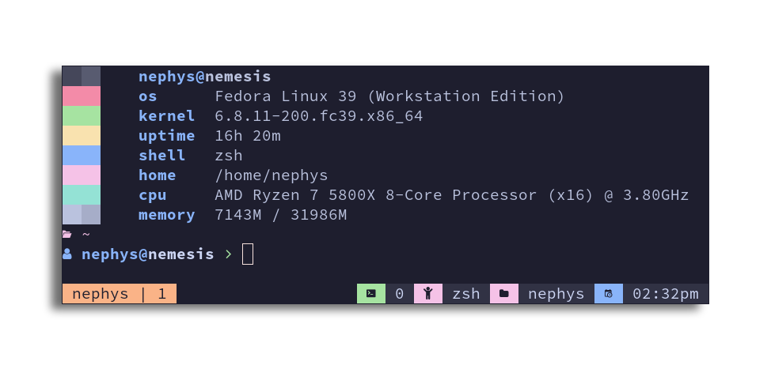

# zshrc
My personal zsh config (may be broken from time to time)

# Prerequisite
Make sure the following binaries are installed on your system first:
 - [tmux](https://github.com/tmux/tmux) -> multiplexer
 - [oh-my-posh](https://github.com/jandedobbeleer/oh-my-posh) -> prompt theme
 - [zoxide](https://github.com/ajeetdsouza/zoxide) -> better cd
 - [tfetch](https://github.com/Nephys/tfetch) -> fetch splash screen
 - [fzf](https://github.com/junegunn/fzf) -> command-line fuzzy finder

[my dotfiles](https://github.com/nephys/.dotfiles)
